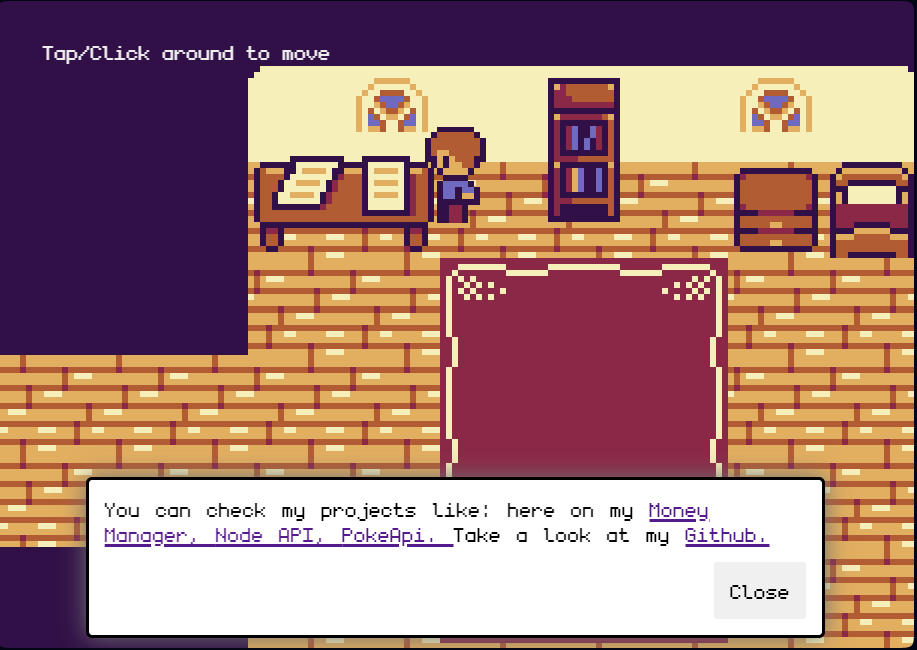

# Portfolio in 2D game 

This project shows you a little about me, what I'm studying and other things.

## Preview

Live Demo : https://portfolio-2d.vercel.app

Credits to JSLegendDev on YouTube : https://www.youtube.com/watch?v=gwtfWORCN0U

# How to run

Note: You need `Node.js` and `npm` installed on your machine.

`npm install` then `npm run dev`

# Technologies   
   
- React;
- Vite;
- Kaboom
- JavaScript
- CSS
- HTML